# AgriRent AI

Agricultural Equipment Rental Platform

## Project Overview

AgriRent AI is a full-stack web application that connects farmers with equipment owners through a secure online rental platform. Users can register, log in, browse available agricultural equipment, view equipment details, create bookings, and manage rentals. Equipment owners can review incoming booking requests and approve, reject, complete, or cancel bookings.

This project is built as an MVP for college capstone Review-I to demonstrate the core application flow end-to-end.

## Features

- User registration and login with JWT authentication
- Equipment listing and equipment details view
- Equipment booking
- My Bookings page for renters
- Owner Panel for booking management
- Booking approval, rejection, completion, and cancellation
- Booking validation with friendly error messages
- Responsive frontend UI
- PostgreSQL database integration

## Tech Stack

### Frontend

- React
- Vite
- Tailwind CSS
- Axios
- React Router

### Backend

- FastAPI
- SQLAlchemy
- Pydantic
- JWT Authentication

### Database

- PostgreSQL

The Review-I MVP database contains five related tables:

- Users
- Equipment
- Bookings
- Equipment Images
- Reviews

## Project Structure

```text
agrirent-ai
|
|-- backend
|   |-- app
|   |   |-- api
|   |   |-- core
|   |   |-- database
|   |   |-- models
|   |   |-- schemas
|   |   |-- services
|   |   `-- main.py
|   `-- requirements.txt
|
|-- frontend
|   |-- src
|   |   |-- api
|   |   |-- assets
|   |   |-- components
|   |   |-- context
|   |   |-- layouts
|   |   |-- pages
|   |   |-- routes
|   |   |-- services
|   |   `-- utils
|   `-- package.json
|
|-- docs
|   |-- diagrams
|   `-- screenshots
|
|-- Problem_Statement.md
`-- README.md
```

## System Architecture

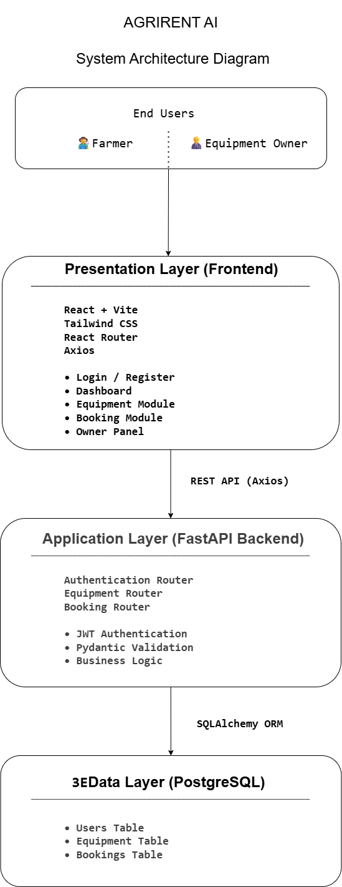

## Database ER Diagram

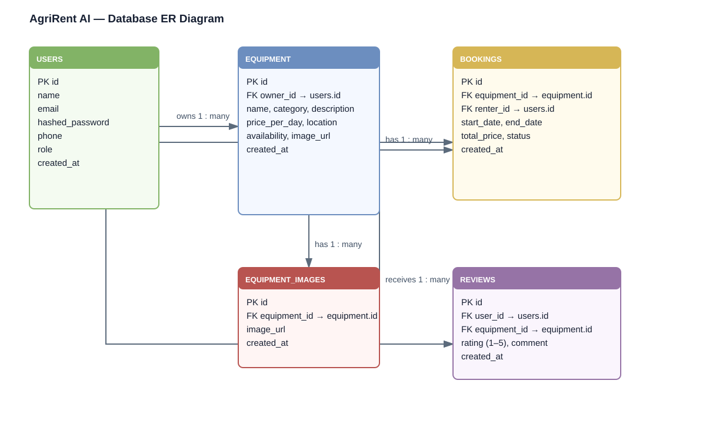

## Module Diagram

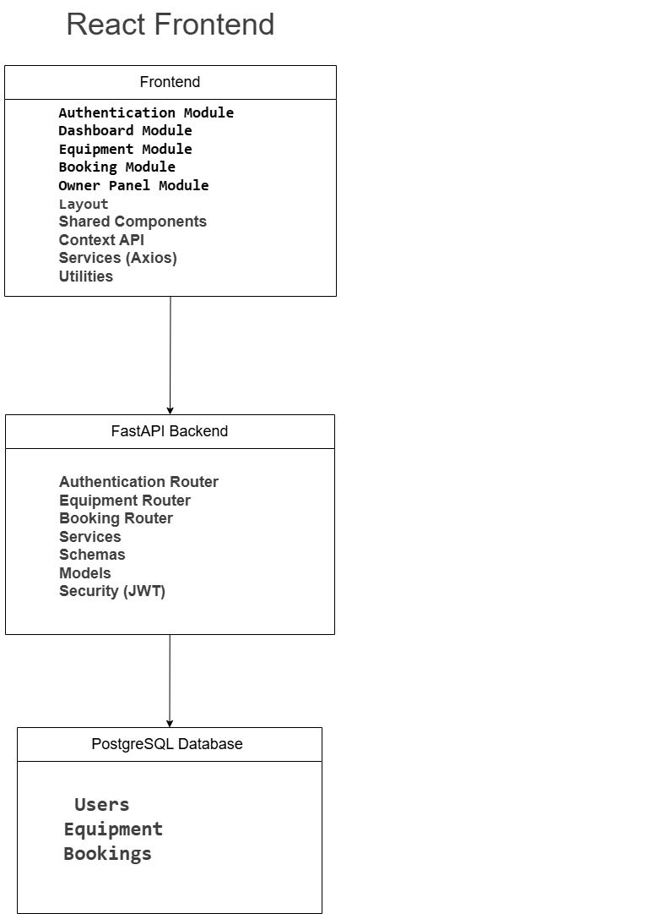

## Class Diagram

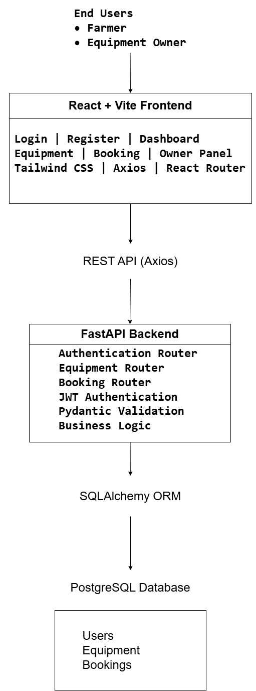

## Application Screenshots

### Login

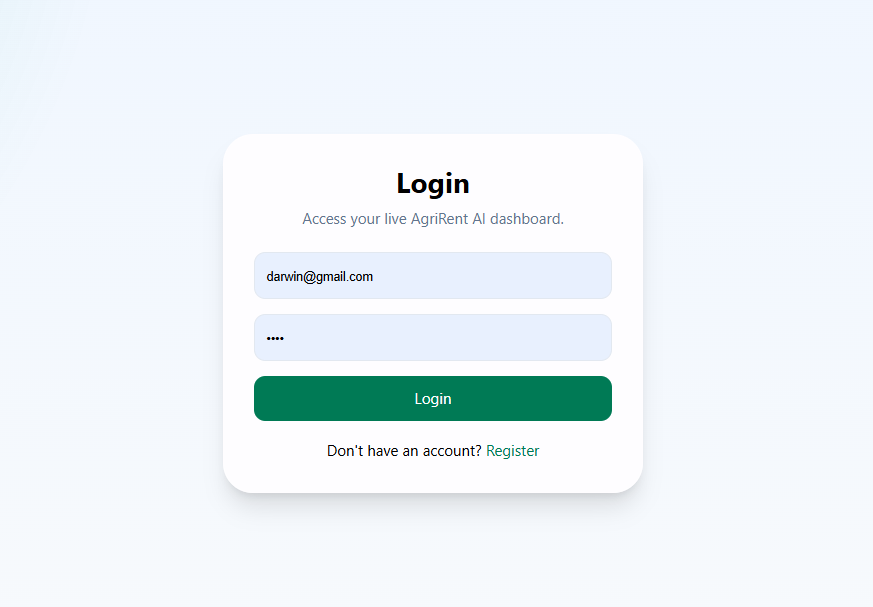

### Dashboard

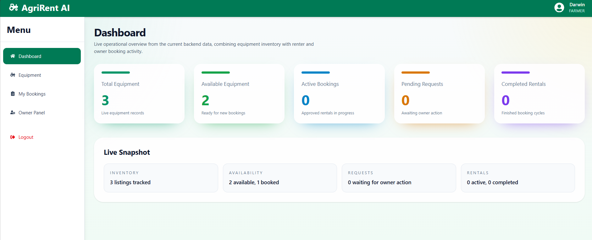

### Equipment List

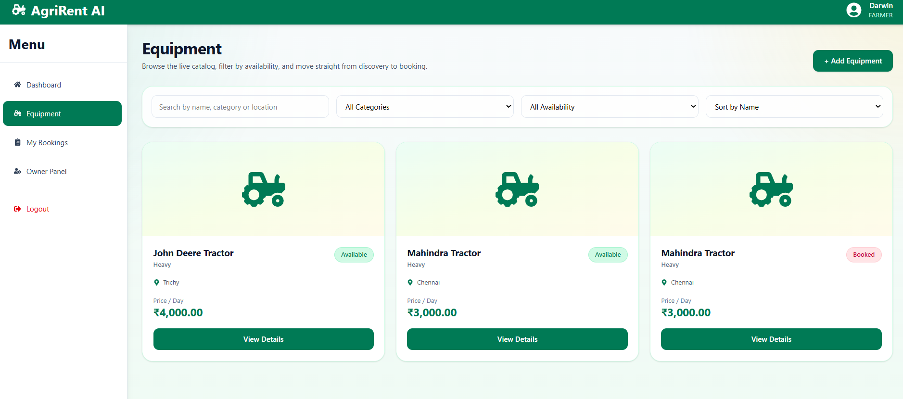

### Equipment Details

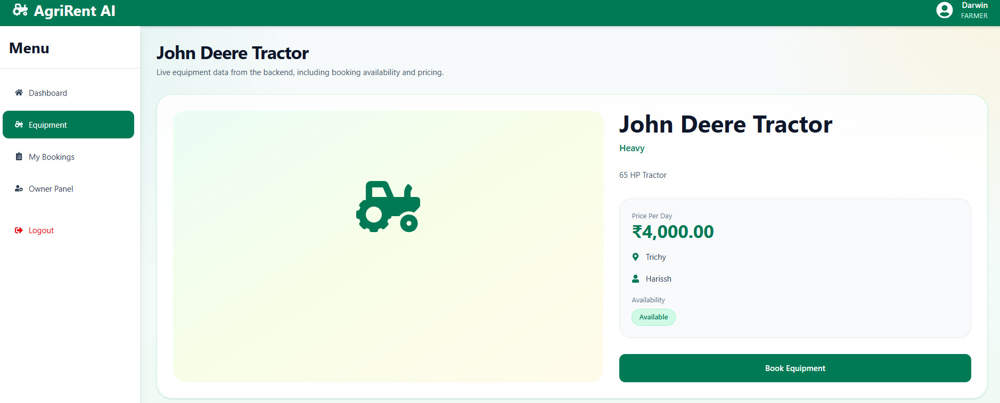

### Book Equipment

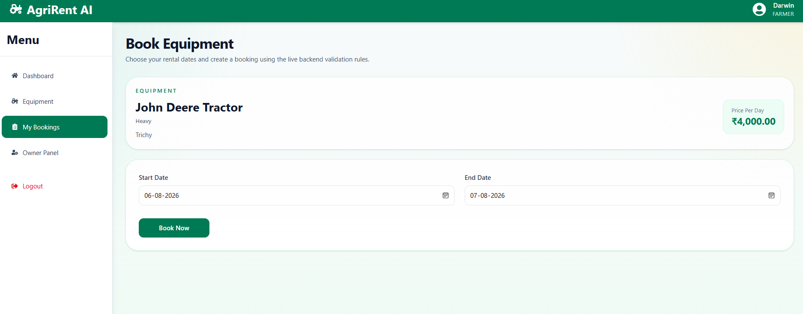

### My Bookings

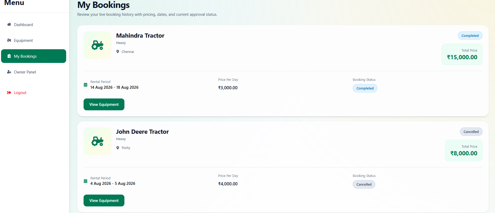

### Owner Panel

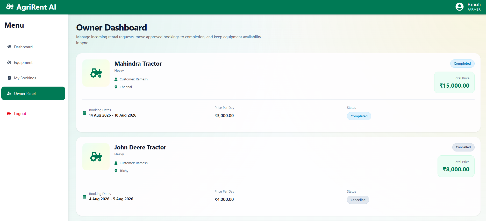

## Local Setup

Before starting the backend, ensure PostgreSQL is running and create a database named `agrirent_ai` (or use a different database name in `DATABASE_URL`).

### 1. Clone the Repository

```bash
git clone https://github.com/harisshchathriya/agrirent-ai.git
cd agrirent-ai
```

### 2. Backend Setup

```bash
cd backend

python -m venv .venv

# Windows
.venv\Scripts\activate

# Linux/macOS
source .venv/bin/activate

# Create the backend environment file from the repository template.
# Windows PowerShell
Copy-Item ..\.env.example .env

# Linux/macOS
cp ../.env.example .env

pip install -r requirements.txt
# Create any missing database tables (safe for the two new Review-I tables).
python -m app.database.init_db
uvicorn app.main:app --reload
```

Backend runs at:

```text
http://127.0.0.1:8000
```

### 3. Frontend Setup

```bash
cd frontend
npm install
npm run dev
```

Frontend runs at:

```text
http://localhost:5173
```

### 4. Environment Notes

The backend requires:

- A valid PostgreSQL database connection in `.env`
- `DATABASE_URL`
- `SECRET_KEY`
- `ALGORITHM`
- `ACCESS_TOKEN_EXPIRE_MINUTES`
- `FRONTEND_URL` (defaults to `http://localhost:5173` for local development)

The frontend reads its API base URL from `VITE_API_URL`. For local development, copy
`frontend/.env.example` to `frontend/.env` or use the built-in local fallback.

## Deployment

This project is prepared for a later cloud deployment but is not deployed yet. The
intended architecture is a Vercel or Netlify frontend, a Render or Railway FastAPI
backend, and a cloud PostgreSQL database.

Configure these backend environment variables in the hosting platform; never commit
their real values:

- `DATABASE_URL` — cloud PostgreSQL SQLAlchemy connection string
- `SECRET_KEY` — long random JWT signing secret
- `ALGORITHM` — JWT algorithm (currently `HS256`)
- `ACCESS_TOKEN_EXPIRE_MINUTES` — JWT lifetime in minutes
- `FRONTEND_URL` — deployed frontend origin, for example `https://<frontend-domain>`

Configure `VITE_API_URL` in the frontend hosting platform to the deployed backend
origin, for example `https://<backend-domain>`. Vite embeds this build-time value in
the frontend bundle, so it must be set before each production build.

The backend exposes `GET /health` for platform health checks. Start the backend from
the `backend` directory with:

```bash
uvicorn app.main:app --host 0.0.0.0 --port $PORT
```

On Windows PowerShell, set the port first (for example,
`$env:PORT=8000`) and run `uvicorn app.main:app --host 0.0.0.0 --port $env:PORT`.
The database tables are initialized manually with `python -m app.database.init_db`;
the deployed service must receive its cloud `DATABASE_URL` before that command runs.

## Continuous Integration

GitHub Actions runs validation on pushes to `main` and on pull requests targeting `main`.
The backend job runs the pytest suite, while the frontend job installs dependencies with
`npm ci`, runs ESLint, and creates a production build with Vite. Any test, lint, or build
failure returns a non-zero exit code and fails the workflow.

Run the same checks locally before opening a pull request:

```bash
cd backend
pytest -v

cd ../frontend
npm ci
npm run lint
npm run build
```

## Future Enhancements

- AI equipment recommendation
- Equipment image upload
- Google Maps integration
- Weather API
- Payment gateway
- Real-time notifications
- Analytics dashboard

## Author

Harissh Chathriya

B.Tech Artificial Intelligence and Data Science

J.J. College of Engineering and Technology

## License

This project is developed for academic and educational purposes.
