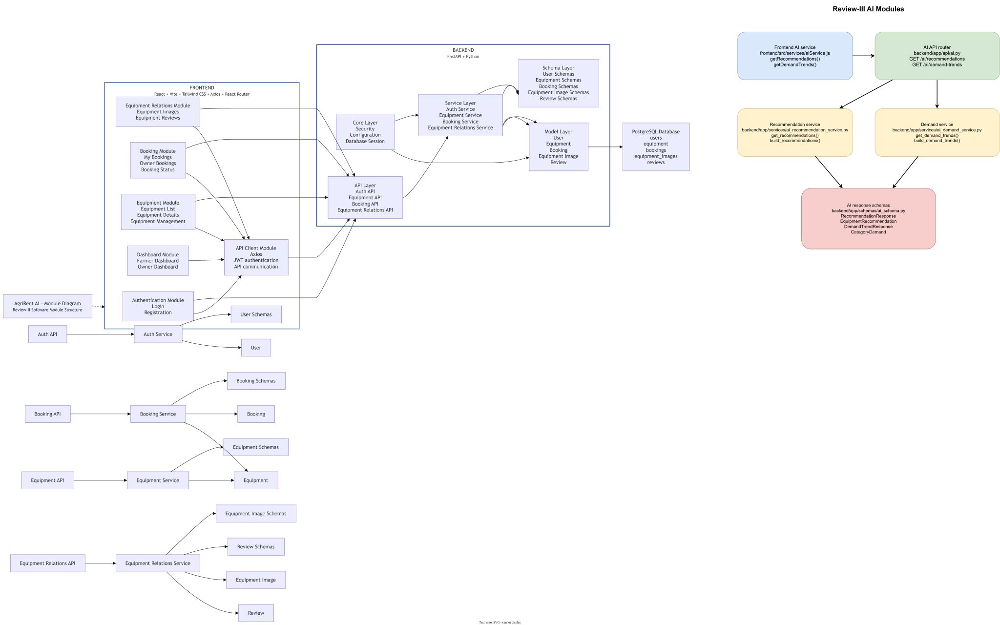
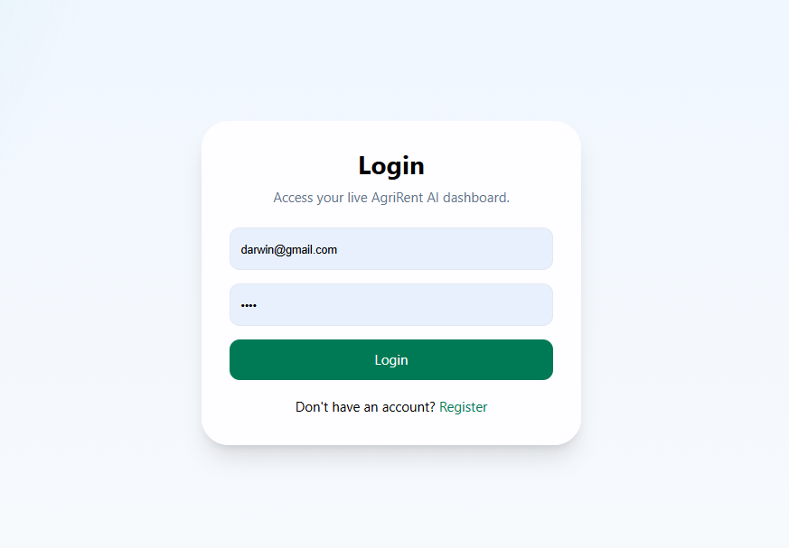
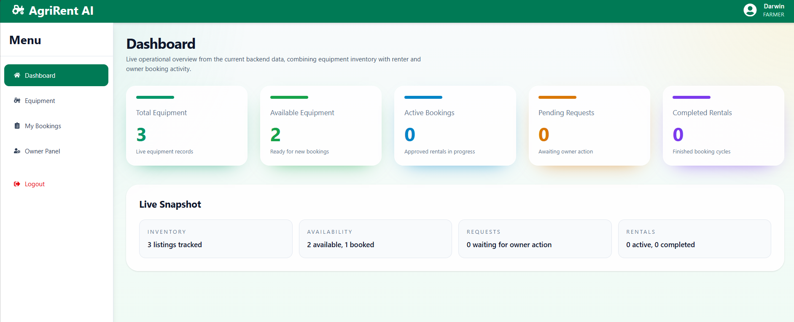
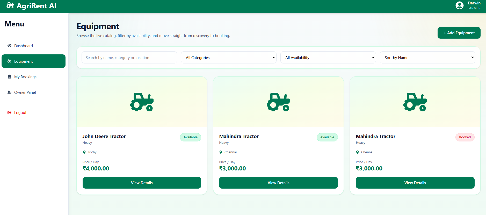
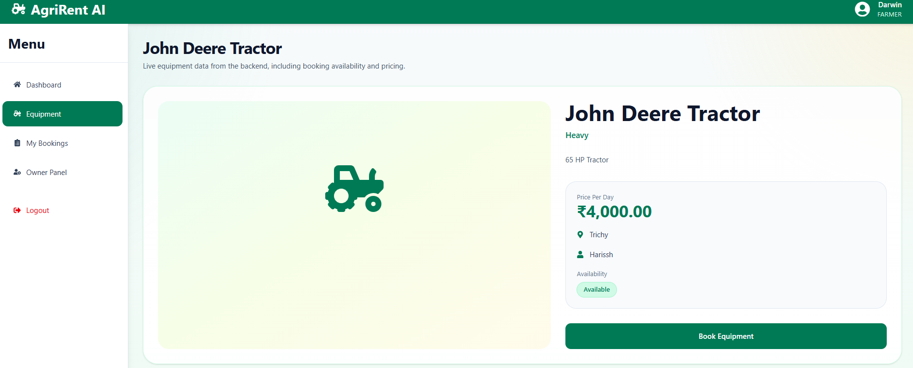
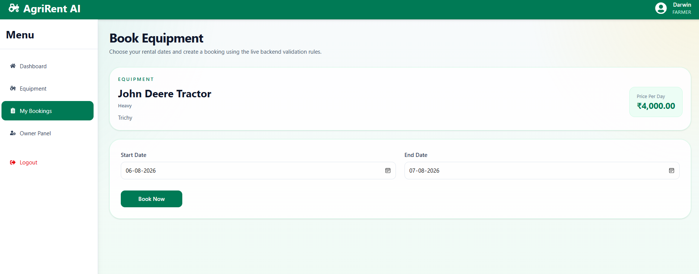
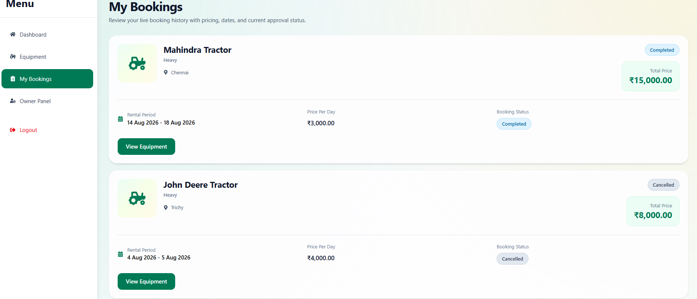
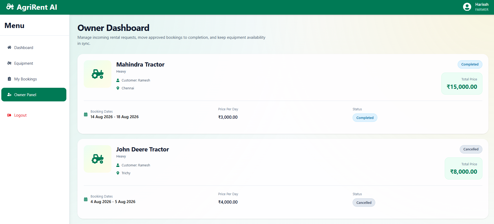

# AgriRent AI

Agricultural Equipment Rental Platform

## Project Overview

AgriRent AI is a full-stack rental platform for agricultural equipment. Farmers can browse equipment, request bookings, and manage their own rentals, while owners can list equipment, approve booking requests, and manage their inventory. The application also includes an admin role for platform oversight and a secure JWT-based authentication flow.

This repository includes the Review-II rental workflow and Review-III AI
insights, alongside role-based access control, persistence, validation, and
deployment support. Administrator accounts remain backend-controlled.

## Problem Statement

The core problem is to reduce the friction between equipment owners and farmers who need short-term access to agricultural machinery. The application connects both parties through a transparent booking workflow, enforces ownership rules, and provides a role-aware dashboard for operations.

## Features

- Farmer and owner public registration with role-aware screens and permissions; admin is backend-controlled
- JWT authentication, bcrypt password hashing, and secure password-reset tokens
- Equipment listing, detail view, and ownership-restricted create/update/delete flows
- Booking creation and lifecycle management
- Validation for past-date, invalid-range, overlap, and ownership rules
- Owner-only booking approval, rejection, completion, and cancellation actions
- Optional equipment image URLs on listing creation and updates, with a placeholder when absent or unavailable
- Farmer-only equipment recommendations using a deterministic booking-frequency heuristic
- Authenticated historical demand by category/month and a guarded one-month moving-average forecast when enough history exists
- PostgreSQL persistence via SQLAlchemy ORM
- Pydantic request validation and safe CORS configuration
- Health endpoint and basic backend logging

## Tech Stack

### Frontend

- React
- Vite
- JavaScript
- Axios
- React Router

### Backend

- FastAPI
- SQLAlchemy ORM
- Pydantic
- PostgreSQL
- JWT / bcrypt

### Architecture

The application follows a simple three-tier design:

- Frontend: React app serving role-based pages and API calls
- Backend: FastAPI application with routers, services, and validation logic
- Database: PostgreSQL for users, equipment, bookings, images, and reviews
- AI insights: FastAPI services analyze existing booking and equipment data without adding database entities

## Roles and Permissions

| Role | Access |
| --- | --- |
| Farmer | Browse equipment, create bookings, view own bookings |
| Owner | Manage own equipment, view owner bookings, approve/reject/complete/cancel bookings for their equipment |
| Admin | Backend-controlled role; not available through public registration |

Authorization is enforced on the backend and not only in the UI.

## Database / ER Information

The PostgreSQL database includes the core application entities:

- Users
- Equipment
- Bookings
- Equipment Images
- Reviews

This structure matches the current ORM models and the ER design artifact in the docs directory.

Password reset tokens are stored separately in an authentication-only table; they do not change the rental-domain entities.

## API Documentation

- Swagger UI: https://agrirent-ai-backend-yrxg.onrender.com/docs
- OpenAPI JSON: https://agrirent-ai-backend-yrxg.onrender.com/openapi.json
- Health check: https://agrirent-ai-backend-yrxg.onrender.com/health

This feature branch implements authentication, equipment management, booking
workflows, equipment relations, and Review-III AI insights. Authenticated farmers can use
`GET /ai/recommendations`; authenticated users can use
`GET /ai/demand-trends` for historical category counts and a one-month forecast
when at least six consecutive observed months are available. The forecast is a
three-month moving average with a chronological three-month evaluation against
a last-month naive baseline. Sparse history returns `insufficient_history` and
no forecast. The recommendation method is a deterministic frequency heuristic,
not a trained model.

The current deployed Render backend does not yet expose the AI routes: its live
OpenAPI document omits both endpoints and direct requests return 404. Do not
consider these endpoints live until a deployment containing this branch is
verified.

Public registration requires a Farmer or Owner selection. The login screen also
provides a password-reset flow: reset tokens are time-limited, stored only as
hashes, and are invalidated after use. In development or demo environments, set
`APP_ENV=development` or `APP_ENV=demo` to log the generated reset URL; production
responses never expose the raw token.

## Local Setup

### 1. Clone the repository

```bash
git clone https://github.com/harisshchathriya/agrirent-ai.git
cd agrirent-ai
```

### 2. Backend setup

```bash
cd backend
python -m venv .venv

# Windows
.venv\Scripts\activate

# Linux/macOS
source .venv/bin/activate

pip install -r requirements.txt
python -m app.database.init_db
uvicorn app.main:app --reload
```

### 3. Frontend setup

```bash
cd frontend
npm install
npm run dev
```

## Environment Variables

Create a local backend environment file from the project template and keep real secrets out of git-tracked files.

```bash
cp .env.example .env
```

Required backend variables:

- `DATABASE_URL`
- `SECRET_KEY`
- `ALGORITHM`
- `ACCESS_TOKEN_EXPIRE_MINUTES`
- `PASSWORD_RESET_TOKEN_EXPIRE_MINUTES` (optional; defaults to 30)
- `FRONTEND_URL`
- `APP_ENV` (set to `development` or `demo` only when reset URLs may be logged)

Frontend runtime configuration:

- `VITE_API_URL`

## Running Backend

```bash
cd backend
uvicorn app.main:app --host 0.0.0.0 --port 8000
```

## Running Frontend

```bash
cd frontend
npm run dev
```

## Testing

```bash
cd backend
python -m pytest -v --cov=app --cov-report=term-missing --cov-fail-under=40

cd ../frontend
npm test
npm run lint
npm run build
```

## CI/CD

GitHub Actions validates the project on pushes to `main` and pull requests targeting `main`.

The workflow installs backend dependencies, runs the backend test suite with coverage enforcement, installs frontend dependencies, runs Node-based presentation tests and ESLint, and builds the frontend. Deployment is managed separately through the configured Render and Vercel integrations; this CI workflow does not deploy the application.

## Deployment

The project uses:

- Render for the FastAPI API backend
- Vercel for the frontend
- Cloud PostgreSQL for persistence

Configured production links:

- Frontend: https://agrirent-ai-teal.vercel.app
- Backend: https://agrirent-ai-backend-yrxg.onrender.com

The backend must receive `DATABASE_URL` and `SECRET_KEY` from the deployment environment, and the frontend build must include the production `VITE_API_URL` before deployment.

## Live Demo URLs

- Frontend: https://agrirent-ai-teal.vercel.app
- Backend: https://agrirent-ai-backend-yrxg.onrender.com
- Swagger: https://agrirent-ai-backend-yrxg.onrender.com/docs

## Security Notes

- JWT tokens are used for authenticated API access.
- Passwords are hashed with bcrypt.
- Sensitive values are stored in environment variables, not committed to the repository.
- CORS is limited to the configured frontend origin and credentials remain enabled for the auth flow.
- Public registration cannot create administrator accounts.
- Password-reset tokens are generated securely, stored as hashes, expire, and are single-use.

## Out-of-Scope Items / Limitations

Review-III adds heuristic equipment recommendations, historical demand trends,
and a guarded baseline forecast. The current local development database has one
qualifying historical month, so it does not currently receive a forecast.
Automated parsing, price-insight analysis, and SmartMatch remain outside the
implemented scope.

## System Architecture

System architecture: [Draw.io diagram](docs/diagrams/System_Architecture.drawio)

## Database ER Diagram


## Module Diagram



## Class Diagram


## Application Screenshots

### Login



### Dashboard



### Equipment List



### Equipment Details



### Book Equipment



### My Bookings



### Owner Panel



## Local Setup

Before starting the backend, ensure PostgreSQL is running and create a database named `agrirent_ai` (or use a different database name in `DATABASE_URL`).

### 1. Clone the Repository

```bash
git clone https://github.com/harisshchathriya/agrirent-ai.git
cd agrirent-ai
```

### 2. Backend Setup

```bash
cd backend

python -m venv .venv

# Windows
.venv\Scripts\activate

# Linux/macOS
source .venv/bin/activate

# Create the backend environment file from the repository template.
# Windows PowerShell
Copy-Item ..\.env.example .env

# Linux/macOS
cp ../.env.example .env

pip install -r requirements.txt
# Create any missing database tables.
python -m app.database.init_db
uvicorn app.main:app --reload
```

Backend runs at:

```text
http://127.0.0.1:8000
```

### 3. Frontend Setup

```bash
cd frontend
npm install
npm run dev
```

Frontend runs at:

```text
http://localhost:5173
```

### 4. Environment Notes

The backend requires:

- A valid PostgreSQL database connection in `.env`
- `DATABASE_URL`
- `SECRET_KEY`
- `ALGORITHM`
- `ACCESS_TOKEN_EXPIRE_MINUTES`
- `FRONTEND_URL` (defaults to `http://localhost:5173` for local development)

The frontend reads its API base URL from `VITE_API_URL`. For local development, copy
`frontend/.env.example` to `frontend/.env` or use the built-in local fallback.

## API Documentation

- Swagger UI: https://agrirent-ai-backend-yrxg.onrender.com/docs
- OpenAPI JSON: https://agrirent-ai-backend-yrxg.onrender.com/openapi.json
- Health check: https://agrirent-ai-backend-yrxg.onrender.com/health

## Deployment

The deployment uses Vercel for the frontend, Render for the FastAPI
backend, and Railway PostgreSQL for persistence.

- Frontend: https://agrirent-ai-teal.vercel.app
- Backend: https://agrirent-ai-backend-yrxg.onrender.com

Configure these backend environment variables in the hosting platform; never commit
their real values:

- `DATABASE_URL` — cloud PostgreSQL SQLAlchemy connection string
- `SECRET_KEY` — long random JWT signing secret
- `ALGORITHM` — JWT algorithm (currently `HS256`)
- `ACCESS_TOKEN_EXPIRE_MINUTES` — JWT lifetime in minutes
- `FRONTEND_URL` — `https://agrirent-ai-teal.vercel.app`

Configure `VITE_API_URL` in the frontend hosting platform as
`https://agrirent-ai-backend-yrxg.onrender.com`. Vite embeds this build-time value in
the frontend bundle, so it must be set before each production build.

The backend exposes `GET /health` for platform health checks. Start the backend from
the `backend` directory with:

```bash
uvicorn app.main:app --host 0.0.0.0 --port $PORT
```

On Windows PowerShell, set the port first (for example,
`$env:PORT=8000`) and run `uvicorn app.main:app --host 0.0.0.0 --port $env:PORT`.
The database tables are initialized manually with `python -m app.database.init_db`;
the deployed service must receive its cloud `DATABASE_URL` before that command runs.

## Continuous Integration

GitHub Actions runs validation on pushes to `main` and on pull requests targeting `main`.
The backend job runs the pytest suite with coverage enforcement, while the frontend job
installs dependencies with `npm ci`, runs Node-based presentation tests and ESLint, and
creates a production build with Vite. Any test, coverage, lint, or build failure returns
a non-zero exit code and fails the workflow.

Run the same checks locally before opening a pull request:

```bash
cd backend
pytest -v --cov=app --cov-report=term-missing --cov-fail-under=40

cd ../frontend
npm test
npm run lint
npm run build
```

## Scope and Future Enhancements

The current scope includes registration, login, JWT authentication, equipment
browsing and creation, booking workflows, owner booking management, validation,
PostgreSQL persistence, equipment recommendations, and historical category
demand trends. Recommendations and demand trends are documented in
`docs/diagrams/API_Contract.md`. A forecast is returned only when the monthly
history sufficiency rule is met; it is not currently available for the sparse
local snapshot. Notifications,
payments, maps, and weather remain future enhancements.

- Google Maps integration
- Weather API
- Payment gateway
- Ratings and reviews
- Real-time notifications

## Author

Harissh Chathriya

B.Tech Artificial Intelligence and Data Science

J.J. College of Engineering and Technology

## License

This project is developed for academic and educational purposes.
